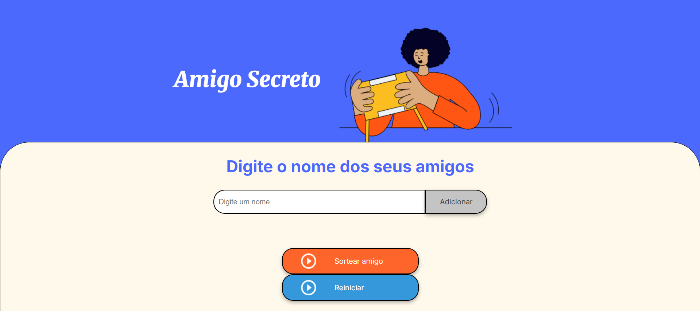

# 🎁 Amigo Secreto - Sorteador Online

Um sorteador de Amigo Secreto simples e eficiente para organizar sua brincadeira! Desenvolvido com HTML, CSS e JavaScript.

🔗 **Link do Projeto:** [https://marcosegv.github.io/AmigoSecreto/](https://marcosegv.github.io/AmigoSecreto/)



## ✨ Funcionalidades Principais

- ✅ Adicionar participantes dinamicamente
- 🎲 Sortear nomes aleatoriamente sem repetição
- 🔄 Reiniciar o sorteio completamente
- 📋 Lista visual atualizada em tempo real

## 🛠 Tecnologias Utilizadas

- HTML5
- CSS3 (Variáveis customizadas)
- JavaScript Vanilla

## 🚀 Como Usar

```bash
# Clonar repositório
git clone https://github.com/Marcosegv/AmigoSecreto.git
cd AmigoSecreto

